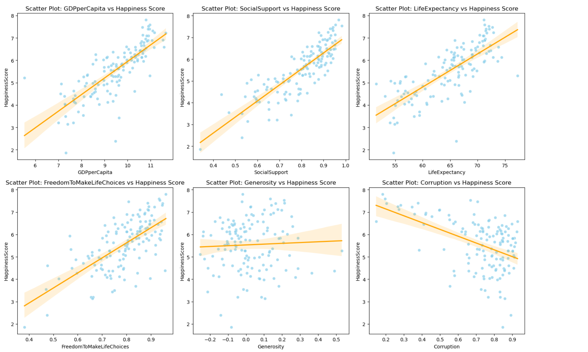

# Global Well-Being Forecast Project

## Overview

The **Global Well-Being Forecast Project** is a data-driven initiative dedicated to predicting happiness scores worldwide. Employing advanced statistical models, exploratory data analysis, and regression analysis, the project aims to unravel the intricate interplay of economic, social, and psychological factors influencing global well-being.

## Source of the data

The dataset being used for this analysis can be found at the below link: https://worldhappiness.report/data/

## Objectives

1. **Exploratory Data Analysis:**
   - Conduct a comprehensive exploratory data analysis to unearth key factors shaping well-being.

2. **Regression Model Implementation:**
   - Implement regression models and enhance efficiency through feature engineering, regularization techniques, and hyperparameter tuning.

3. **Precise Regression Models:**
   - Develop precise regression models, including Linear, LASSO, Ridge, Elastic Net, and Polynomial Regression, to forecast happiness scores with remarkable accuracy.

## Technologies Used

- **Python:**
  - Leveraged for data preprocessing, statistical modeling, and scripting.

- **Jupyter Notebooks:**
  - Utilized for interactive and detailed data analysis.

- **Pandas:**
  - Employed for data manipulation and transformation.

### Machine Learning Frameworks

- **scikit-learn:**
  - Implemented several regression models, such as Linear Regression, LASSO Regression, Ridge Regression, Elastic Net, and Polynomial Regression.

- **Visualization Tools:**
  - **Matplotlib and Seaborn:**
    - Used for data visualization and insights presentation.
   

